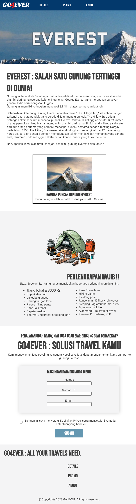

<div align="center">

<h4>Simple web-design without any libraries</h4>
</div>

## What is GO4EVER
GO4EVER is a website design that uses simple html, css, and Javascript syntax to build. This project is required for completing assigments at Dicoding.com (Indonesian programming learning website).

## Overview


## Getting started
1. Just clone this project and you're ready to go.

## Workflow
1. One page html
2. Header contains navigation bar and logo
3. Main contains details, more-details and promo
4. Footer contains information, copyrights and navigation bar
4. JavaScript contains simple fade-in when page loads and alert() when custom-button pressed

## Featureless
You can improve / add some of this feature on your project :
1. Responsive website (this project just use max-width : 800px)
```sh
320px — 480px for mobile devices,
481px — 768px for iPads & tablets,
769px — 1024px for small screens like laptop,
1025px — 1200px for large screens like Desktops
```
2. Make it more 'live' using more Javascript code
my message for **DICODING USER**
```sh
**DO NOT USE ANY LIBRARIES FOR EASY LAYOUTS,
YOUR PROJECT WILL BE REJECTED!**
```

## Clone
```sh
git clone https://github.com/d1azdn/go4ever
```